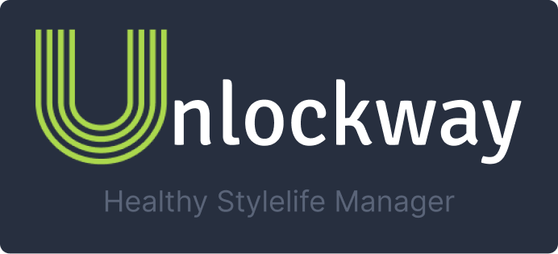

# 🥘 Healthy Meal Manager Mobile App (TCC Project)



  

> Acess the [PT-BR](./README-PTBR.md) Version

This project was developed during college as part of an interdisciplinary integration project (TCC). The Healthy Meal Manager Mobile App is a user-friendly Flutter application designed to help users manage their healthy meal routines and receive timely notifications. The app connects to a robust backend API built with Spring Boot, which handles meal planning, user data, and notifications.

The mobile app is built using Flutter and Dart, ensuring a smooth and responsive cross-platform experience for both Android and iOS users. It follows modern development practices and integrates seamlessly with the backend API for data management. The app features an intuitive user interface, designed with usability in mind, and leverages Flutter's rich widget library to deliver a polished experience.

For development, the app is tested on both physical devices and Android Studio emulators. It uses JWT-based authentication to securely communicate with the backend, ensuring user data is protected. The app is designed to be scalable and maintainable, making it easy to add new features or improvements in the future.

> Access the Layout prototype built on Figma clicking [here](https://www.figma.com/design/eVCIm7PVUYjDSV6PrifbAG/Fatec---Projeto-Integrador%3A-Unlockway?node-id=0-1&t=JH2hcRXH9DhEu4BF-1)

## Prerequisites

Before you begin, ensure you have the following installed:

- **Flutter SDK**: Install Flutter

- **Android Studio**: Download Android Studio

- **Java Development Kit (JDK)**: Install JDK

- **Git**: Install Git

## Setup Instructions

1. **Clone the Repositories**
   First, clone the Unlockway UI repository:

```sh
    git clone https://github.com/unlockway/unlockway_api_v2.git
    cd unlockway_api_v2
    # Follow the API's README for further setup
```

    Next, clone the Unlockway API repository and follow its README for setup instructions:

```sh
    git clone https://github.com/unlockway/unlockwayui
    cd unlockwayui
```

2. **Set Up Your Device**
   You can either use a physical device or create a virtual device using Android Studio:

- **Physical Device**: Enable Developer Mode and USB debugging on your Android device.

- **Virtual Device**: Follow the  to create and configure an emulator.

## Running the Application

1. **Start the API Server**
   Navigate to the API repository and start the server:

```sh
   cd unlockway_api_v2
# Follow the API's README to start the server
```

2. **Run the Flutter App**
   Navigate back to the Unlockway UI repository and run the app:

```sh
   cd ../unlockwayui
   flutter pub get
   flutter run
```

## How to Contribute

1. **Fork the repository**

2. **Create a new branch:**

   ```sh
   git checkout -b feature/your-feature-name
   ```

3. **Make your changes and commit them:**

   ```sh
   git commit -m "Add your message here"
   ```

4. **Push to the branch:**

   ```sh
   git push origin feature/your-feature-name
   ```

5. **Create a Pull Request**

### Contributors

|  |  |  |  |  |
| :-------------------------------------------------: | :----------------------------------------------------: | :-------------------------------------------------------: | :-------------------------------------------------: | :---------------------------------------------: |
|   [Victor H. Silva](https://github.com/vickttor)    |   [Bruno Pequeno](https://github.com/bruno-pequenor)   |   [Daniel Vieira](https://github.com/DanielVieira2828)    |   [Felipe Thaylan](https://github.com/ThaylanFe)    |   [João Zavisas](https://github.com/Zavisas)    |
